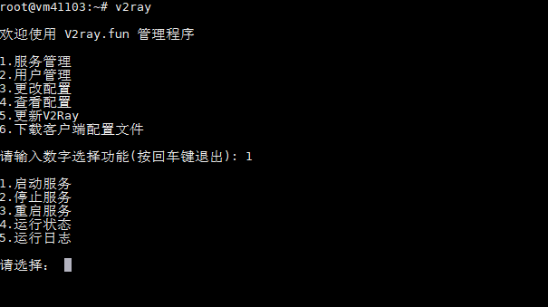
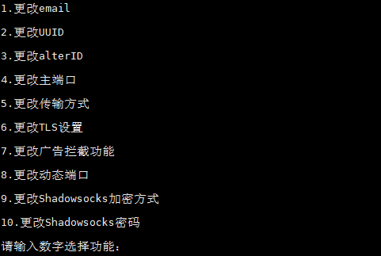
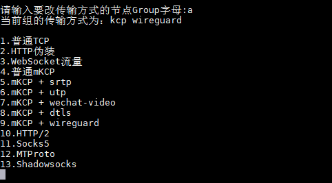
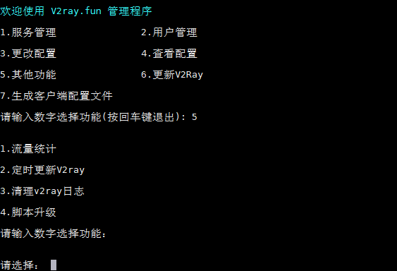

<!-- vim-markdown-toc GFM -->

* [multi-v2ray](#multi-v2ray)
    * [特色](#特色)
    * [功能](#功能)
    * [安装命令](#安装命令)
    * [升级命令](#升级命令)
    * [卸载命令](#卸载命令)
    * [命令行参数](#命令行参数)
    * [截图](#截图)
    * [系统要求](#系统要求)
    * [更新日志](#更新日志)
    * [特别说明](#特别说明)
    * [感谢](#感谢)

<!-- vim-markdown-toc -->

# multi-v2ray
V2ray多用户控制管理脚本，向导式更改端口，加密方式，传输协议，享受V2ray的乐趣~  

## 特色
- 调用v2ray官方api进行流量统计
- **多用户, 多端口管理**, 混合传输协议管理不再是梦
- 首次安装时产生随机端口，默认配置mkcp + 随机一种 (srtp | wechat-video | utp | dtls) header伪装;  
  安装完成显示配置信息;  **脚本跑完即可放心食用！**
- 每天**北京时间**早上3点自动升级重启v2ray核心,降低v2ray因内存小被kill几率。可关闭开启此功能。
- 查看配置信息显示vmess字符串(v2rayN的分享链接格式)
- 生成**Telegram**的socks5/MTProto分享链接, 支持socks5 + tls组合
- 支持http/2, 随机生成伪装h2 path
- 开启关闭动态端口
- 支持程序和**命令行参数**管理

## 功能
- 一键 启动 / 停止 / 重启 V2ray 服务端
- 流量统计
- 命令行模式管理v2ray
- 支持多用户， 多端口管理
- 开启关闭动态端口
- 快速查看服务器连接信息, 常规配置修改
- 自由更改**传输配置**：
  - 常规TCP
  - HTTP头部伪装
  - WebSocket流量
  - 常规mKCP流量
  - mKCP 伪装 FaceTime通话流量(srtp)
  - mKCP 伪装 BT下载流量(utp)
  - mKCP 伪装 微信视频通话流量(wechat-video)
  - mKCP 伪装 DTLS 1.2流量(dtls)
  - HTTP/2的tls流量(h2)(需备域名) 
  - Socks5
  - MTProto

**WebSocket和HTTP/2不包括Nginx分流，请自行安装Nginx来分流。**

## 安装命令

```bash
source <(curl -sL https://git.io/fNgqx)
```

## 升级命令(保留配置文件，升级失败请全新安装)
```bash
source <(curl -sL https://git.io/fNgqx) -k
```

## 卸载命令
```bash
source <(curl -sL https://git.io/fNgqx) --remove
```

## 命令行参数
```bash
   v2ray -h                   查看帮助
   v2ray start                启动 V2Ray
   v2ray stop                 停止 V2Ray
   v2ray restart              重启 V2Ray
   v2ray status               查看 V2Ray 运行状态
   v2ray log                  查看 V2Ray 运行日志
   v2ray update               更新 V2Ray
   v2ray update.sh            更新 multi-v2ray脚本
   v2ray add                  新增mkcp + 随机一种 (srtp | wechat-video | utp) header伪装的端口(Group)
   v2ray add [wechat|utp|srtp|dtls|socks5|mtproto]     新增一种协议的组，端口随机,如 v2ray add utp 为新增utp协议
   v2ray del                  删除端口组
   v2ray info                 查看配置
   v2ray port                 修改端口
   v2ray tls                  修改tls
   v2ray stream               修改传输协议
   v2ray stats                流量统计
   v2ray clean                清理日志
```

## 截图









## 系统要求

- Debian 7 
- Debian 8
- **Debian 9（推荐）** 
- Ubuntu 14 
- Ubuntu 16 
- Ubuntu 18
- CentOS 7

**不支持Centos 6**

## 更新日志
**2018.7.28**  
项目改名为multi-v2ray  
重构安装脚本, 仅留一个multi-v2ray.sh, 支持指令  
管理程序v2ray支持命令行参数  
增加wiki

**2018.7.27**  
支持MTProto

**2018.7.15**  
增加清理日志,更新脚本菜单

**2018.6.26**  
支持Socks5

**2018.6.21**  
加入流量统计

**2018.6.16**  
代码完全重构, 多用户多端口管理初版

**2018.5.31**  
增加DTLS header type

**2018.5.14**  
加入自动升级v2ray功能, 每天北京时间早上3点自动升级重启v2ray核心,降低v2ray因内存小被kill几率

**2018.5.13**  
安装和升级脚本合二为一

**2018.5.6**  
支持http/2一键开启关闭, 项目本身转为独立项目

**2018.5.3**   
支持开启动态端口

**2018.3.23**  
安装完脚本即显示完整的v2ray配置信息,进一步提高v2ray部署速度

**2018.3.8**   
优化菜单显示  
升级v2ray.fun保留配置文件  
首次安装默认配置改为mkcp+随机三种伪装type之一, 用于快速部署v2ray

**2018.3.6**  
增加配置文件vmess字符串生成显示,增加修改alterId的菜单

**2018.3.5**  
第一次安装产生随机端口

**2017.10.16**  
新增TLS功能，自动获取证书。

**2017.9.4**  
第一版通过测试发布。

## 特别说明

有任何问题或者新功能想法欢迎提交 Issue。

本程序遵循 GPL v3协议发布，请Fork保留源项目地址，谢谢！

由于官方统计方式的限制, v2ray core重启就会重置统计流量数据！


## 感谢

V2ray: [https://v2ray.com](https://v2ray.com)

雨落无声的v2ray.fun: [YLWS-4617](https://github.com/YLWS-4617)
