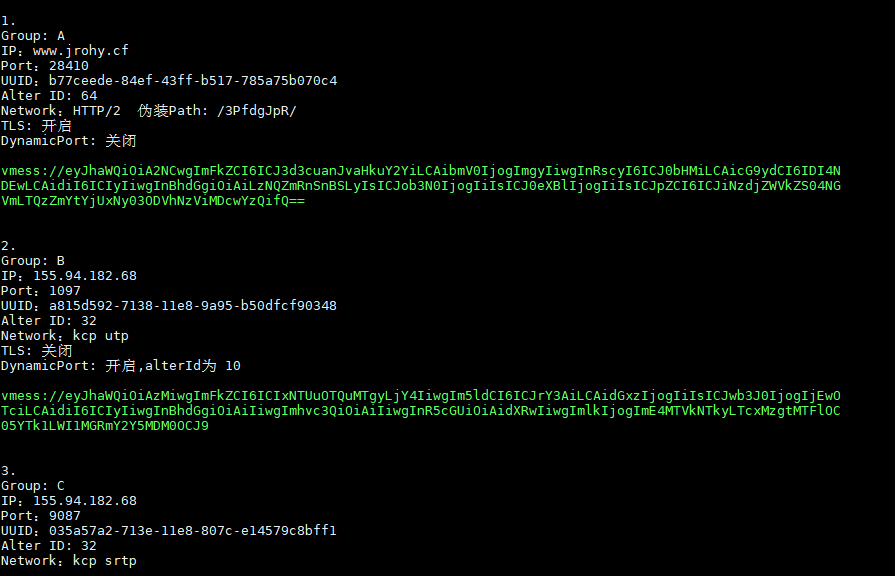

# V2ray.fun
V2ray控制脚本，向导式更改端口，加密方式，传输协议，享受V2ray的乐趣~

## 功能

- 一键 启动 / 停止 / 重启 V2ray 服务端
- 自动随机生成 UUID
- 自助修改端口
- 快速查看服务器连接信息
- 一键下载客户端配置文件（通过szrz程序，xshell，secureCRT还有[macOS的iterm2](https://github.com/tracyone/v2ray.fun/wiki/MAC使用RZ、SZ远程上传下载文件都支持)都支持）
- 自由更改**传输配置**：
  - 常规TCP
  - HTTP头部伪装
  - WebSocket流量
  - 常规mKCP流量
  - mKCP 伪装 FaceTime通话流量
  - mKCP 伪装 BT下载流量
  - mKCP 伪装 微信视频通话流量

**WebSocket不包括Nginx分流，请自行安装Nginx来分流。**

## 安装命令

```bash
bash -c "$(curl -fsSL https://raw.githubusercontent.com/tracyone/v2ray.fun/master/install.sh)"
```

## 升级命令
```bash
bash -c "$(curl -fsSL https://raw.githubusercontent.com/tracyone/v2ray.fun/master/upgrade.sh)"
```

## 卸载命令
```bash
bash -c "$(curl -fsSL https://raw.githubusercontent.com/tracyone/v2ray.fun/master/uninstall.sh)"
```


## 截图




## 系统要求

- Debian 7 
- **Debian 8（推荐）**
- Ubuntu 14 
- Ubuntu 16 
- CentOS 7

**不支持Centos 6**

## 软件要求

请使用**Xshell**连接服务器，以获得完美的中文支持以及配置文件下载功能。

## 更新日志

**2017.9.4**
第一版通过测试发布。

**2017.10.16**
新增TLS功能，自动获取证书。

## 特别说明

有任何问题或者新功能想法欢迎提交 Issue，我会抽空回答。

也可以先查看下本仓库的[wiki](https://github.com/tracyone/v2ray.fun/wiki)

本程序遵循 GPL v3协议发布，请Fork保留源项目地址，谢谢！


## 感谢

V2ray : [https://v2ray.com](https://v2ray.com)

v2ray.fun的原作者: [YLWS-4617](https://github.com/YLWS-4617)
