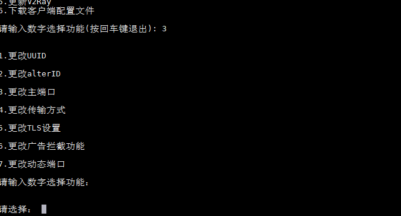

<!-- vim-markdown-toc GFM -->

* [V2ray.fun](#v2rayfun)
    * [功能](#功能)
    * [安装命令](#安装命令)
    * [升级命令](#升级命令)
    * [卸载命令](#卸载命令)
    * [截图](#截图)
    * [系统要求](#系统要求)
    * [软件要求](#软件要求)
    * [更新日志](#更新日志)
    * [特别说明](#特别说明)
    * [感谢](#感谢)

<!-- vim-markdown-toc -->

# V2ray.fun
V2ray控制脚本，向导式更改端口，加密方式，传输协议，享受V2ray的乐趣~  

相对[原版](https://github.com/YLWS-4617)(作者已删库)增加了:
- 查看配置信息显示vmess字符串(v2rayN的分享链接格式)
- 首次安装时产生随机端口，默认配置mkcp + 随机一种 (srtp | wechat-video | utp) header伪装;  
  安装完成显示配置信息;  **脚本跑完即可放心食用！**
- 修改alterId入口
- 开启关闭动态端口
- 支持http/2, 随机生成伪装h2 path
- v2ray升级菜单
- 每天**北京时间**早上3点自动升级重启v2ray核心,降低v2ray因内存小被kill几率

## 功能
- 一键 启动 / 停止 / 重启 V2ray 服务端
- 自动随机生成 UUID
- 开启关闭动态端口
- 自助修改端口
- 快速查看服务器连接信息
- 一键下载客户端配置文件（通过szrz程序，xshell，secureCRT还有macOS的iterm2都支持）
- 自由更改**传输配置**：
  - 常规TCP
  - HTTP头部伪装
  - WebSocket流量
  - 常规mKCP流量
  - mKCP 伪装 FaceTime通话流量(srtp)
  - mKCP 伪装 BT下载流量(utp)
  - mKCP 伪装 微信视频通话流量(wechat-video)
  - HTTP/2的tls流量(h2)(需备域名) 

**WebSocket和HTTP/2不包括Nginx分流，请自行安装Nginx来分流。**

## 安装命令

```bash
bash <(curl -sL https://git.io/vpHpE)
```

## 升级命令(保留配置文件，升级失败请全新安装)
```bash
bash <(curl -sL https://git.io/vpHpE) keep
```

## 卸载命令
```bash
bash <(curl -sL https://git.io/vpHho)
```


## 截图




## 系统要求

- Debian 7 
- **Debian 8（推荐）**
- Debian 9 
- Ubuntu 14 
- Ubuntu 16 
- CentOS 7

**不支持Centos 6**

## 软件要求

请使用**Xshell**连接服务器，以获得完美的中文支持以及配置文件下载功能。

## 更新日志
**2018.5.14**  
加入自动升级v2ray功能, 每天北京时间早上3点自动升级重启v2ray核心,降低v2ray因内存小被kill几率

**2018.5.13**  
安装和升级脚本合二为一

**2018.5.6**  
支持http/2一键开启关闭, 项目本身转为独立项目

**2018.5.3**   
支持开启动态端口

**2018.3.23**  
安装完脚本即显示完整的v2ray配置信息,进一步提高v2ray部署速度

**2018.3.8**   
优化菜单显示  
升级v2ray.fun保留配置文件  
首次安装默认配置改为mkcp+随机三种伪装type之一, 用于快速部署v2ray

**2018.3.6**  
增加配置文件vmess字符串生成显示,增加修改alterId的菜单

**2018.3.5**  
第一次安装产生随机端口

**2017.10.16**  
新增TLS功能，自动获取证书。

**2017.9.4**  
第一版通过测试发布。

## 特别说明

有任何问题或者新功能想法欢迎提交 Issue。

本程序遵循 GPL v3协议发布，请Fork保留源项目地址，谢谢！


## 感谢

V2ray: [https://v2ray.com](https://v2ray.com)

本项目的源fork地址: [tracyone/v2ray.fun](https://github.com/tracyone/v2ray.fun)

v2ray.fun的原作者: [YLWS-4617](https://github.com/YLWS-4617)
